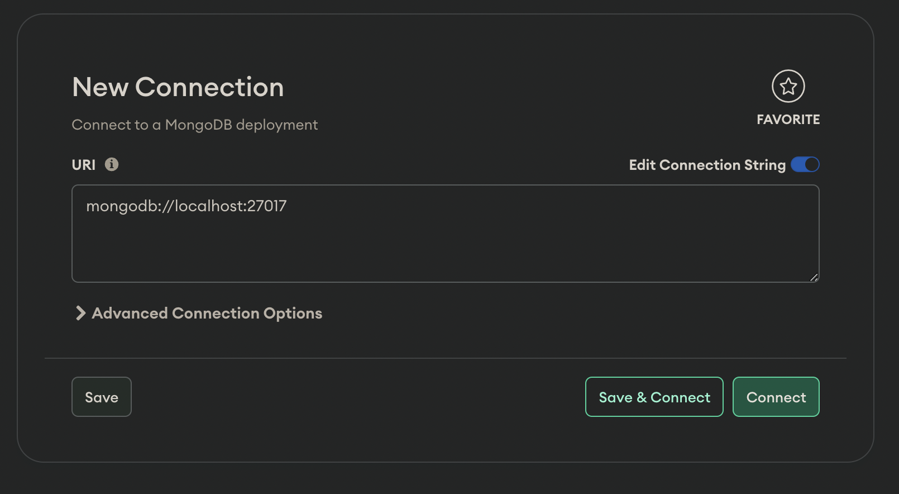

# MongoDB Atlas Local for local development

A single-container local MongoDB setup with replica set, Atlas Search, and Vector Search — no Atlas subscription required.

## Prerequisites

* [Docker Desktop](https://www.docker.com/products/docker-desktop)
* [MongoDB Compass](https://www.mongodb.com/download-center/compass?tck=docs_compass) (optional, for a GUI)

## Usage

```sh
# Start
docker compose up -d

# Stop
docker compose stop
```

The container auto-initializes a replica set, so transactions and change streams work out of the box.

## Connecting

**Mongo Shell:**
```sh
mongosh mongodb://127.0.0.1:27017
```

**MongoDB Compass:**
```
mongodb://localhost:27017/?readPreference=primary&directConnection=true&ssl=false
```



## Features

This setup uses [mongodb/mongodb-atlas-local](https://www.mongodb.com/docs/atlas/cli/current/atlas-cli-deploy-docker/) which provides:

- **Replica set** — transactions and change streams
- **Atlas Search** — full-text search indexes on your local data
- **Vector Search** — vector similarity search for AI/ML workloads

## Test with Node.js

```sh
npm install
npm start
```

This runs a small script that inserts documents and performs a transaction to verify everything works.

## Migrating from the 3-node replica set

If you were previously using the 3-node `mongo:8.0` replica set setup from this repo, your data needs to be migrated with `mongodump` / `mongorestore`.

1. **While still on the old setup**, dump your data:
   ```sh
   docker compose up -d
   docker exec mongo1 mongodump --out /dump
   docker cp mongo1:/dump ./dump-migration
   ```

2. **Stop and remove** old containers and volumes:
   ```sh
   docker compose down -v
   ```

3. **Pull the latest version** of this repo and start the new container:
   ```sh
   docker compose up -d
   ```

4. **Restore** into the new container:
   ```sh
   docker cp ./dump-migration mongodb:/dump
   docker exec mongodb mongorestore --drop /dump
   ```

5. **Clean up:**
   ```sh
   rm -rf ./dump-migration
   ```

## Resources

- [MongoDB Atlas Local Docker](https://www.mongodb.com/docs/atlas/cli/current/atlas-cli-deploy-docker/)
- [The MongoDB Homebrew Tap](https://github.com/mongodb/homebrew-brew)
- [MongoDB Docker Hub](https://hub.docker.com/r/mongodb/mongodb-atlas-local)
